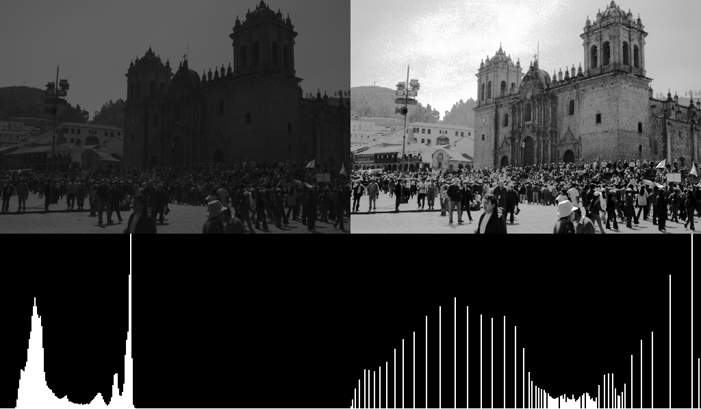
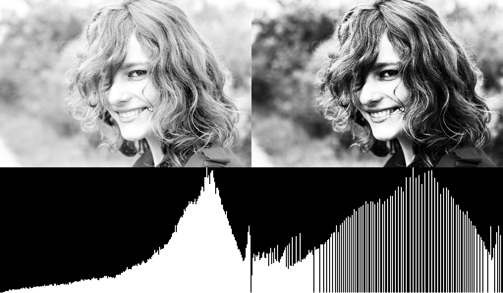
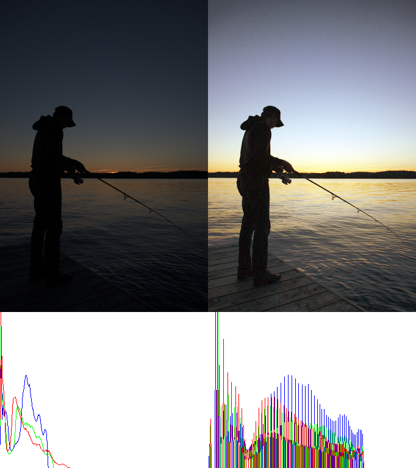
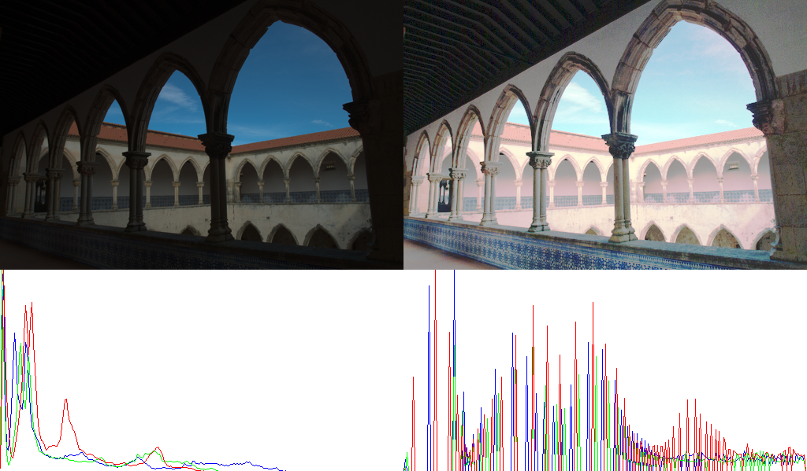

# 原理

# 结果

**灰度图**

图像对比度较低，像素集中在较低的灰度值，经过直方图均衡化之后，很明显对比度增强，同时亮度分布也往低灰度迁移，但也引入了很大的噪声（天空）。

**彩色图像**

缺乏曝光的图像，对比度也容易较低，比如，我们能清楚看到一些细节，虽然直接乘以一个数也能得到，哈哈

但是也不是所有彩色图像都适合

那直方图均衡到底适合什么样的图像呢？

# 参考

1. 看这一篇就够了 https://www.cnblogs.com/tianyalu/p/5687782.html

