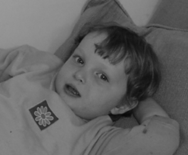
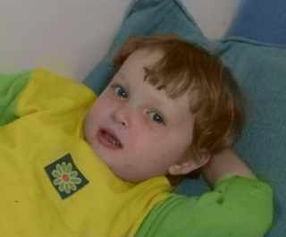
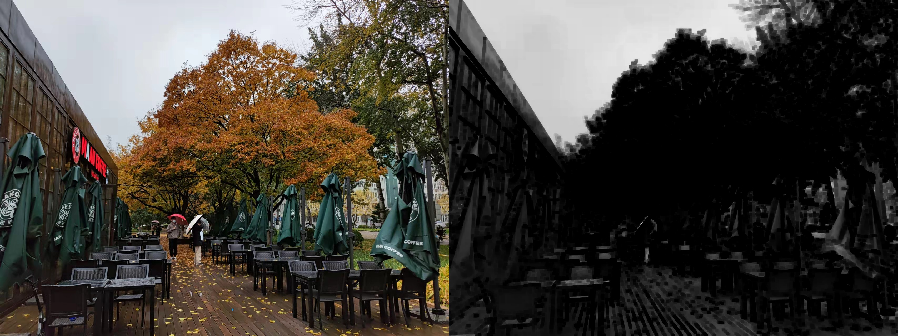
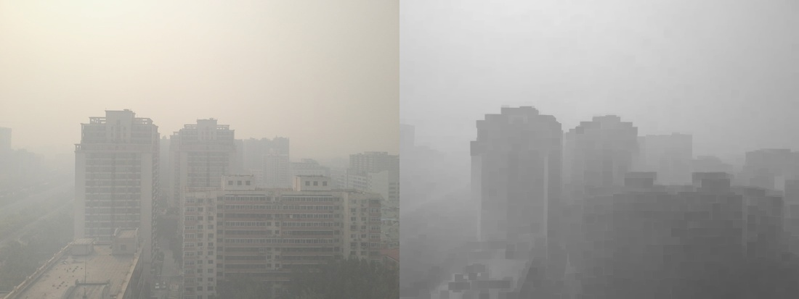
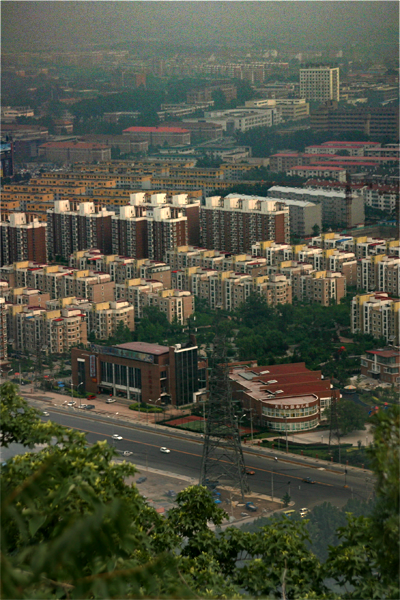
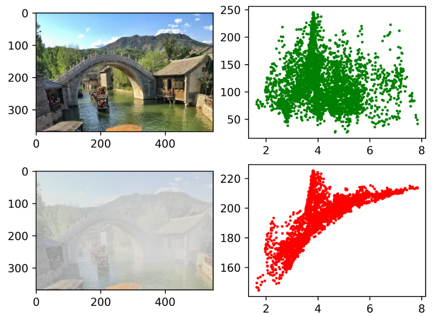
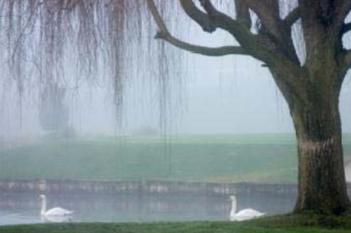

# 简介

知乎：[山与水你和我](https://www.zhihu.com/people/fluence2crane)

个人代码仓库之一， 以传统图像处理和相关算法为主（浅尝辄止），主要语言 C++，日后有空会陆续更新一些经典、有趣的算法。

涉及以下内容：

- [colorization](https://github.com/hermosayhl/image_processing/tree/main/colorization)：        着色
- [compression](https://github.com/hermosayhl/image_processing/tree/main/compression)：      图像压缩
- [deblur](https://github.com/hermosayhl/image_processing/tree/main/deblur)：                 去模糊
- [dehaze](https://github.com/hermosayhl/image_processing/tree/main/dehaze)：                去雾
- [denoise](https://github.com/hermosayhl/image_processing/tree/main/denoise)：               去噪
- [detection](https://github.com/hermosayhl/image_processing/tree/main/detection)：            检测
- [editing](https://github.com/hermosayhl/image_processing/tree/main/editing)：                 编辑
- [fusion](https://github.com/hermosayhl/image_processing/tree/main/fusion)：                  融合
- [filter](https://github.com/hermosayhl/image_processing/tree/main/filter)：                     滤波器
- [geometry](https://github.com/hermosayhl/image_processing/tree/main/geometry)：            几何
- [HDR](https://github.com/hermosayhl/image_processing/tree/main/hdr)：                     高动态范围
- [inpainting](https://github.com/hermosayhl/image_processing/tree/main/inpainting)：           修复
- [interpolation](https://github.com/hermosayhl/image_processing/tree/main/interpolation)：      插值、采样
- [low-light](https://github.com/hermosayhl/image_processing/tree/main/low-light)：              暗光增强
- [matting](https://github.com/hermosayhl/image_processing/tree/main/matting)：                抠图
- [optical flow](https://github.com/hermosayhl/image_processing/tree/main/optical_flow)：         光流
- [quality](https://github.com/hermosayhl/image_processing/tree/main/quality_metrics)：                 质量评测
- [super resolution](https://github.com/hermosayhl/image_processing/tree/main/super_resolution)：超分辨

# 环境

- OpenCV    4.5.5
- GCC           10.3.0（C++17）
- Python      3.7
- CUDA         >=10.1（可选）
- CMake       3.17
- XMake       2.7.4（可选）
- Eigen3       3.3.9（可选）

# 算法

## colorization

(2004 SIGGRAPH)**Colorization using Optimization ** [code](https://github.com/hermosayhl/image_processing/tree/main/colorization/colorization_using_optimization)

基于涂鸦的自动着色

<table>
    <tr>
        <td >
输入
</td>
        <td >
mark
</td>
        <td >
着色结果
</td>
    </tr>
</table>

## compression

waiting

## deblur

waiting

## dehaze

(2009 CVPR)**Single Image Haze Removal Using Dark Channel Prior**  [code](https://github.com/hermosayhl/image_processing/tree/main/dehaze/single_dehaze_he)

何恺明大名鼎鼎的暗通道先验去雾，2009 CVPR best paper

<table>
    <tr>
        <td align='center' valian='middle'>
无雾场景
</td>
        <td align='center' valian='middle'>
有雾场景
</td>
    </tr>
</table>

<table>
    <tr>
        <td align='center' valian='middle'>
输入
</td>
        <td align='center' valian='middle'>
结果
</td>
    </tr>
</table>

代码中包含了暗通道先验验证、guided filter 精细化等内容。

(2015 TIP)**A Fast Single Image Haze Removal Algorithm Using Color Attenuation Prior**  [code](https://github.com/hermosayhl/image_processing/tree/main/dehaze/fast_cap)

基于颜色衰减先验的去雾算法，使用机器学习估计参数

颜色衰减先验

去雾流程

<table>
    <tr>
        <td align='center' valian='middle'>
输入
</td>
        <td align='center' valian='middle'>
深度图
</td>
        <td align='center' valian='middle'>
暗通道
</td>
    </tr>
    <tr>
    	<td align='center' valian='middle'>
引导滤波
</td>
        <td align='center' valian='middle'>
最远点
</td>
        <td align='center' valian='middle'>
结果
</td>
    </tr>
</table>

