# 简介

知乎：[山与水你和我](https://www.zhihu.com/people/fluence2crane)


个人代码仓库之一， 以传统图像处理和相关算法为主（浅尝辄止），主要语言 C++，日后有空会陆续更新一些经典、有趣的算法。

涉及以下内容：

- [colorization](https://github.com/hermosayhl/image_processing/tree/main/colorization)：        着色
- [compression](https://github.com/hermosayhl/image_processing/tree/main/compression)：      图像压缩
- [deblur](https://github.com/hermosayhl/image_processing/tree/main/deblur)：                 去模糊
- [dehaze](https://github.com/hermosayhl/image_processing/tree/main/dehaze)：                去雾
- [denoise](https://github.com/hermosayhl/image_processing/tree/main/denoise)：               去噪
- [detection](https://github.com/hermosayhl/image_processing/tree/main/detection)：            检测
- [editing](https://github.com/hermosayhl/image_processing/tree/main/editing)：                 编辑
- [fusion](https://github.com/hermosayhl/image_processing/tree/main/fusion)：                  融合
- [filter](https://github.com/hermosayhl/image_processing/tree/main/filter)：                     滤波器
- [geometry](https://github.com/hermosayhl/image_processing/tree/main/geometry)：            几何
- [HDR](https://github.com/hermosayhl/image_processing/tree/main/hdr)：                     高动态范围
- [inpainting](https://github.com/hermosayhl/image_processing/tree/main/inpainting)：           修复
- [interpolation](https://github.com/hermosayhl/image_processing/tree/main/interpolation)：      插值、采样
- [low-light](https://github.com/hermosayhl/image_processing/tree/main/low-light)：              暗光增强
- [matting](https://github.com/hermosayhl/image_processing/tree/main/matting)：                抠图
- [optical flow](https://github.com/hermosayhl/image_processing/tree/main/optical_flow)：         光流
- [quality](https://github.com/hermosayhl/image_processing/tree/main/quality_metrics)：                 质量评测
- [super resolution](https://github.com/hermosayhl/image_processing/tree/main/super_resolution)：超分辨

# 环境

- OpenCV    4.5.5
- GCC           10.3.0（C++17）
- Python      3.7
- CUDA         >=10.1（可选）
- CMake       3.17
- XMake       2.7.4（可选）
- Eigen3       3.3.9（可选）

# 算法

## colorization

(2004 SIGGRAPH)**Colorization using Optimization**  [code](https://github.com/hermosayhl/image_processing/tree/main/colorization/colorization_using_optimization)

基于涂鸦的自动着色

<table>
    <tr>
        <td ><center>输入</center></td>
        <td ><center>mark</center></td>
        <td ><center>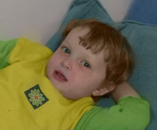着色结果</center></td>
    </tr>
</table>


## compression

waiting


## deblur

waiting


## dehaze

(2009 CVPR)**Single Image Haze Removal Using Dark Channel Prior**  [code](https://github.com/hermosayhl/image_processing/tree/main/dehaze/single_dehaze_he)

何恺明大名鼎鼎的暗通道先验去雾，2009 CVPR best paper

<table>
    <tr>
        <td align='center' valian='middle'><center>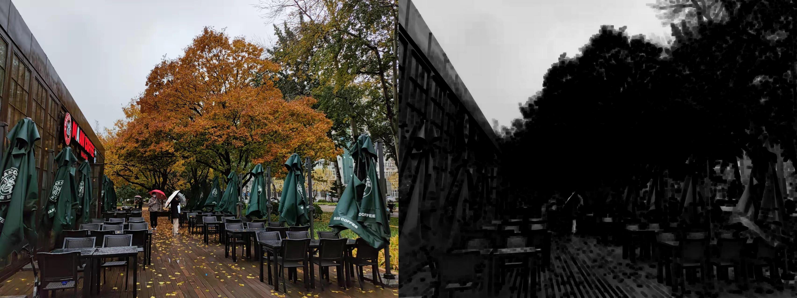无雾场景</center></td>
        <td align='center' valian='middle'><center>有雾场景</center></td>
    </tr>
</table>

<table>
    <tr>
        <td align='center' valian='middle'><center>输入</center></td>
        <td align='center' valian='middle'><center>结果</center></td>
    </tr>
</table>

代码中包含了暗通道先验验证、guided filter 精细化等内容。


(2015 TIP)**A Fast Single Image Haze Removal Algorithm Using Color Attenuation Prior**  [code](https://github.com/hermosayhl/image_processing/tree/main/dehaze/fast_cap)

基于颜色衰减先验的去雾算法，使用机器学习估计参数

颜色衰减先验

<center>
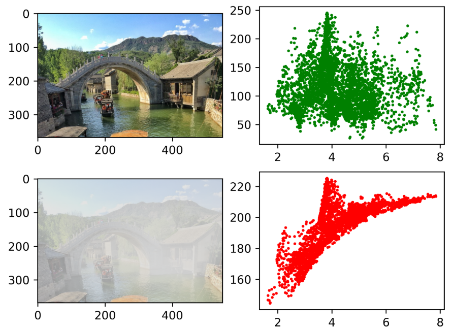
</center>

去雾流程

<table>
    <tr>
        <td align='center' valian='middle'><center>输入</center></td>
        <td align='center' valian='middle'><center>深度图</center></td>
        <td align='center' valian='middle'><center>暗通道</center></td>
    </tr>
    <tr>
    	<td align='center' valian='middle'><center>引导滤波</center></td>
        <td align='center' valian='middle'><center>最远点</center></td>
        <td align='center' valian='middle'><center>结果</center></td>
    </tr>
</table>

## denoise

去噪算法

1. (1990 TPAMI)**Scale-space and edge detection using anisotropic diffusion**   [code]()  [知乎]()

    anisotropic_diffusion 各向异性滤波

    <table>
        <tr>
            <td align='center' valian='middle'><center>输入</center></td>
            <td align='center' valian='middle'><center>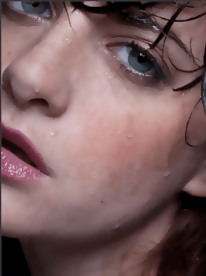结果</center></td>
        </tr>
    </table>

2. gaussian filter 高斯滤波

    后续将出优化专篇。

    <table>
        <tr>
            <td align='center' valian='middle'><center>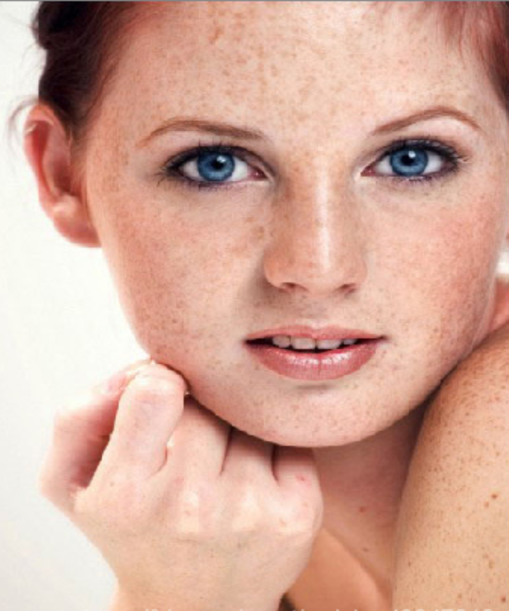输入</center></td>
            <td align='center' valian='middle'><center>结果</center></td>
        </tr>
    </table>

3. bilateral filter 双边滤波，提供 CPU/CUDA 实现，日后出优化专篇。

    <table>
        <tr>
            <td align='center' valian='middle'><center>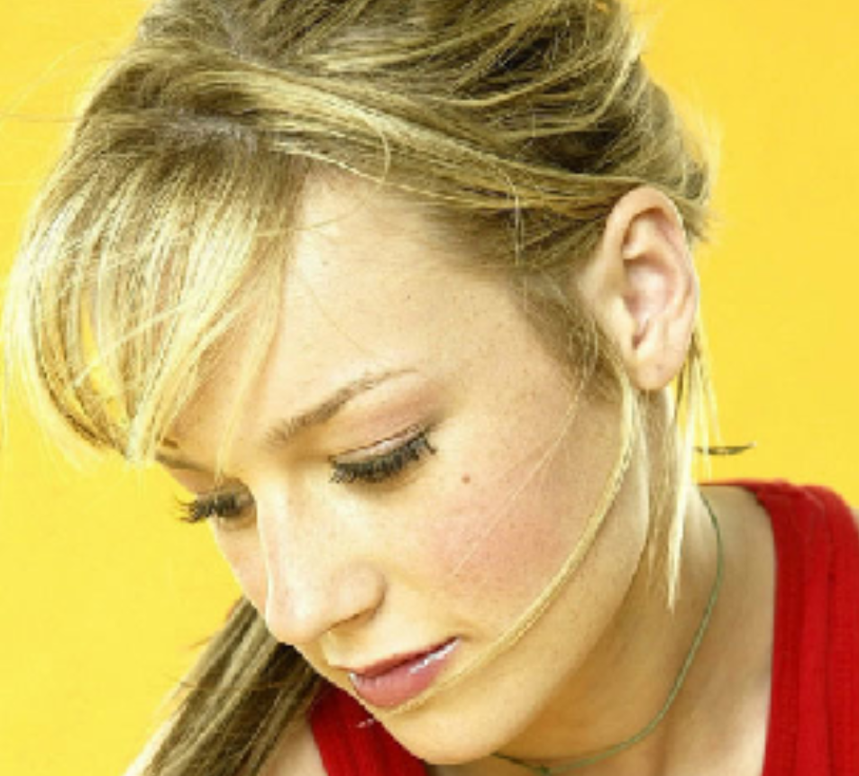输入</center></td>
            <td align='center' valian='middle'><center>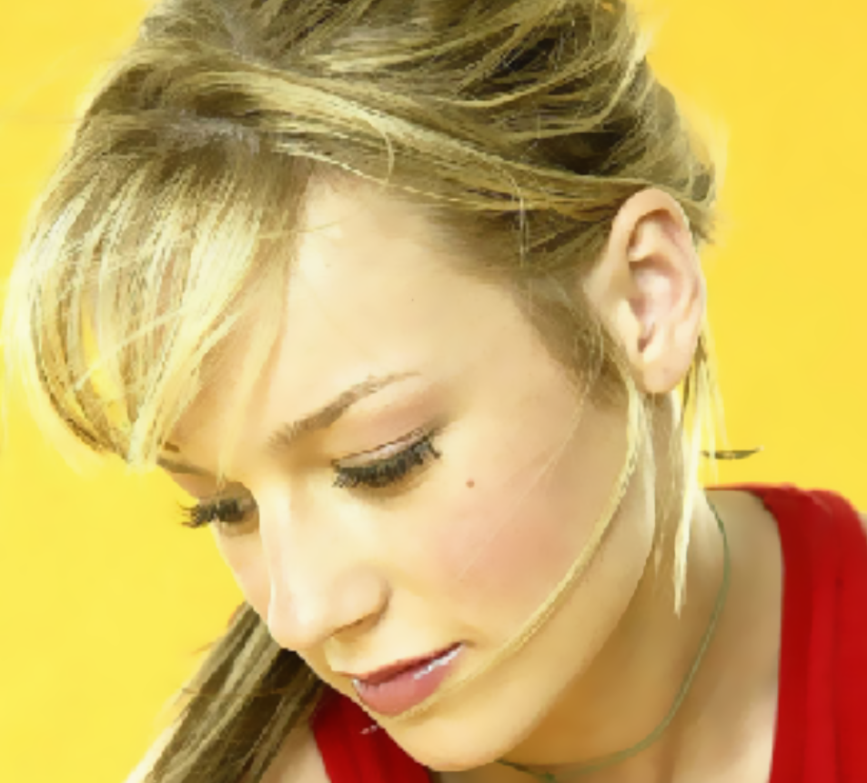结果</center></td>
        </tr>
    </table>

4. (2006 ECCV)**A Fast Approximation of the Bilateral Filter using a Signal Processing Approach**

    bilateral filter using grid 网格加速双边滤波，目前参考官方实现，日后出 CUDA 版本。

    <table>
        <tr>
            <td align='center' valian='middle'><center>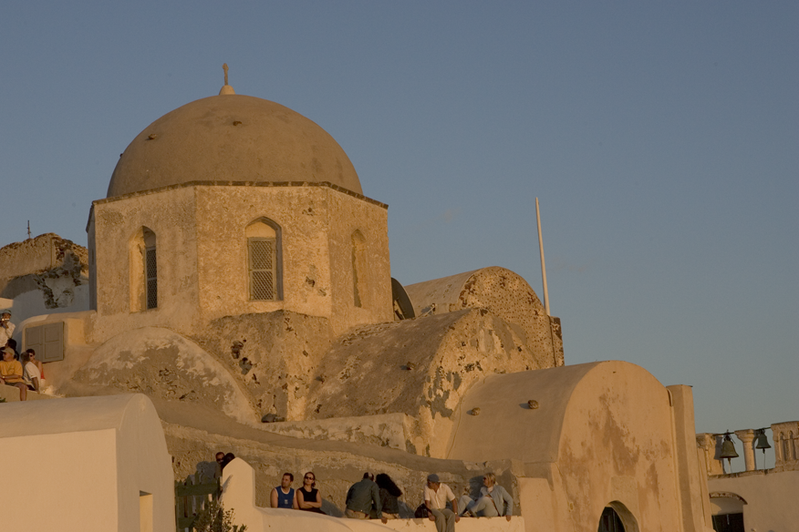输入</center></td>
            <td align='center' valian='middle'><center>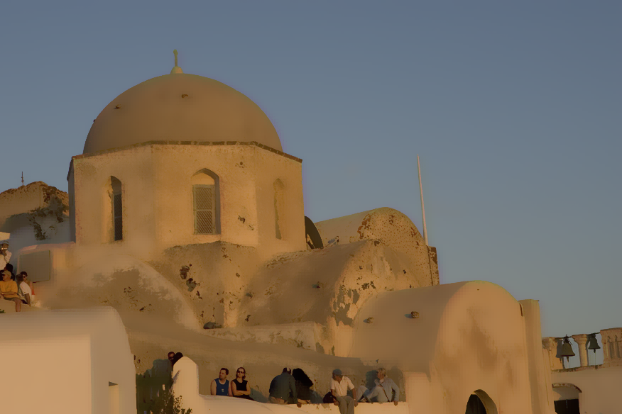结果</center></td>
        </tr>
    </table>

5. (2005)**A non-local algorithm for image denoising**

    non local means 滤波，提供 CPU/CUDA 实现。后续出优化专篇，其中涉及快速均值滤波。

    <table>
        <tr>
            <td align='center' valian='middle'><center>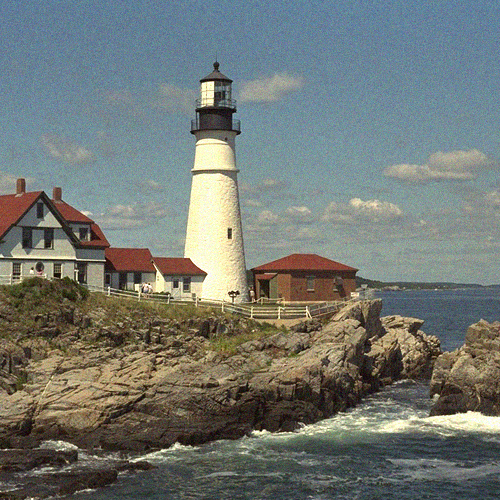输入</center></td>
            <td align='center' valian='middle'><center>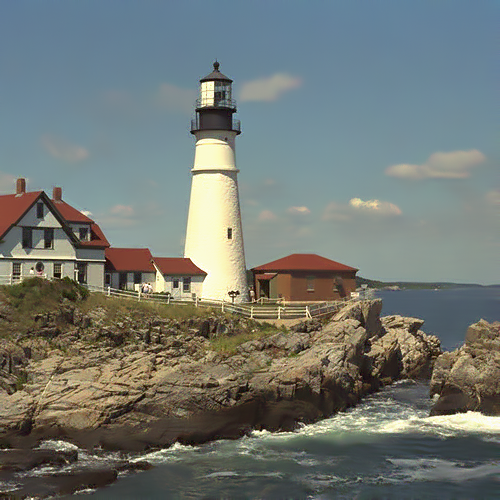结果</center></td>
        </tr>
    </table>


## detection

1. (1986)**A Computational Approach to Edge Detection**   [code]()  [知乎]()
    Canny 边缘检测算法。

    <table>
        <tr>
            <td align='center' valian='middle'><center>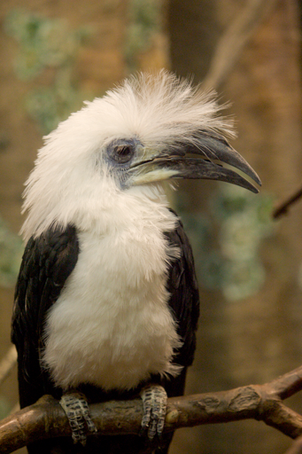输入</center></td>
            <td align='center' valian='middle'><center>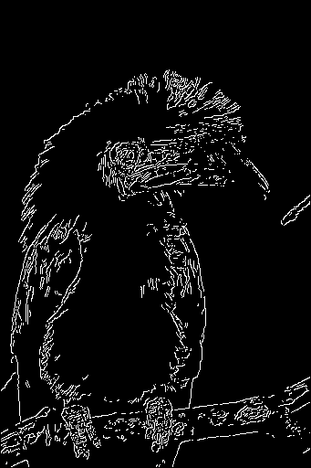结果</center></td>
        </tr>
    </table>

2. (1988)**A combined corner and edge detector**  [code]()  [知乎]()

    Harris 角点检测算法。 

    <table>
        <tr>
            <td align='center' valian='middle'><center>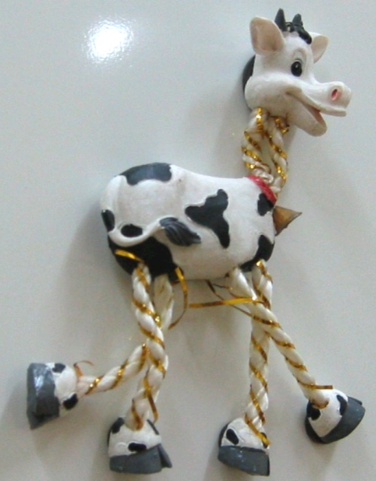输入</center></td>
            <td align='center' valian='middle'><center>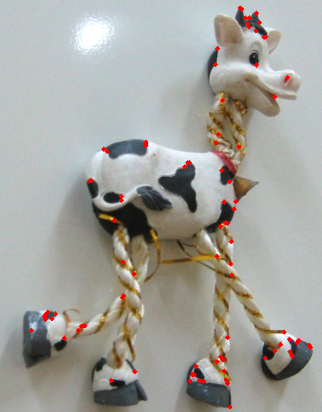结果</center></td>
        </tr>
    </table>

3. **Laplace** 算子 [code]()  [知乎]()

    边缘检测。

    <table>
        <tr>
            <td align='center' valian='middle'><center>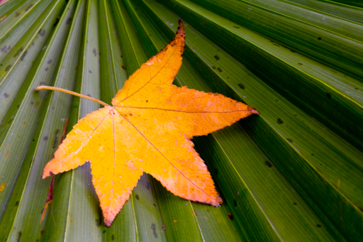输入</center></td>
            <td align='center' valian='middle'><center>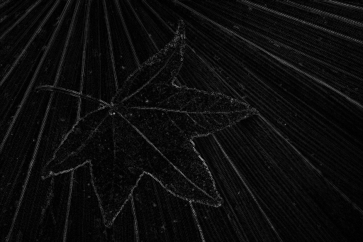结果</center></td>
        </tr>
    </table>

    **LOG**（Laplacian of Gaussian）检测特征点

    <table>
        <tr>
            <td align='center' valian='middle'><center>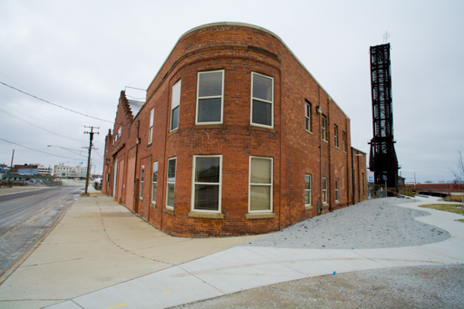输入</center></td>
            <td align='center' valian='middle'><center>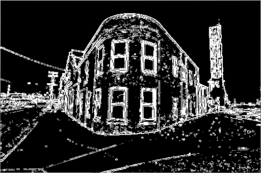边缘</center></td>
        </tr>
        <tr>
            <td align='center' valian='middle'><center>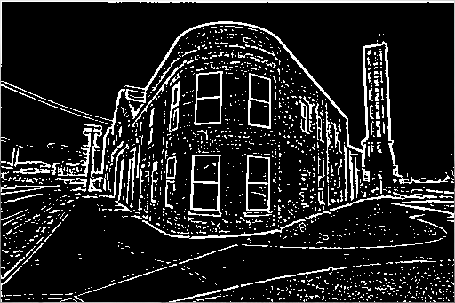NMS</center></td>
            <td align='center' valian='middle'><center>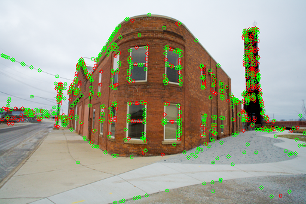特征点</center></td>
        </tr>
    </table>

4. (1983)**A Multiresolution Spline with Application to Image Mosaics** [code]()  [知乎]()

    Laplace Pyramid 拉普拉斯金字塔。

    图像压缩

    <table>
        <tr>
            <td align='center' valian='middle'><center>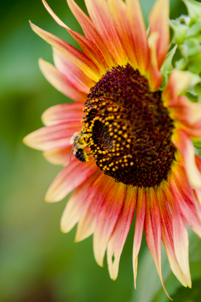输入</center></td>
            <td align='center' valian='middle'><center>压缩</center></td>
        </tr>
    </table>

    图像融合

    <table>
    	<tr>
            <td align='center' valian='middle'><center>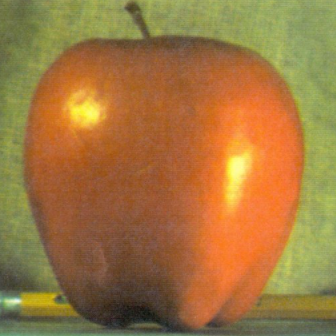左图</center></td>
            <td align='center' valian='middle'><center>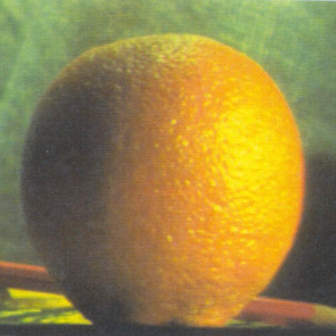右图</center></td>
        </tr>
        <tr>
            <td align='center' valian='middle'><center>掩码</center></td>
            <td align='center' valian='middle'><center>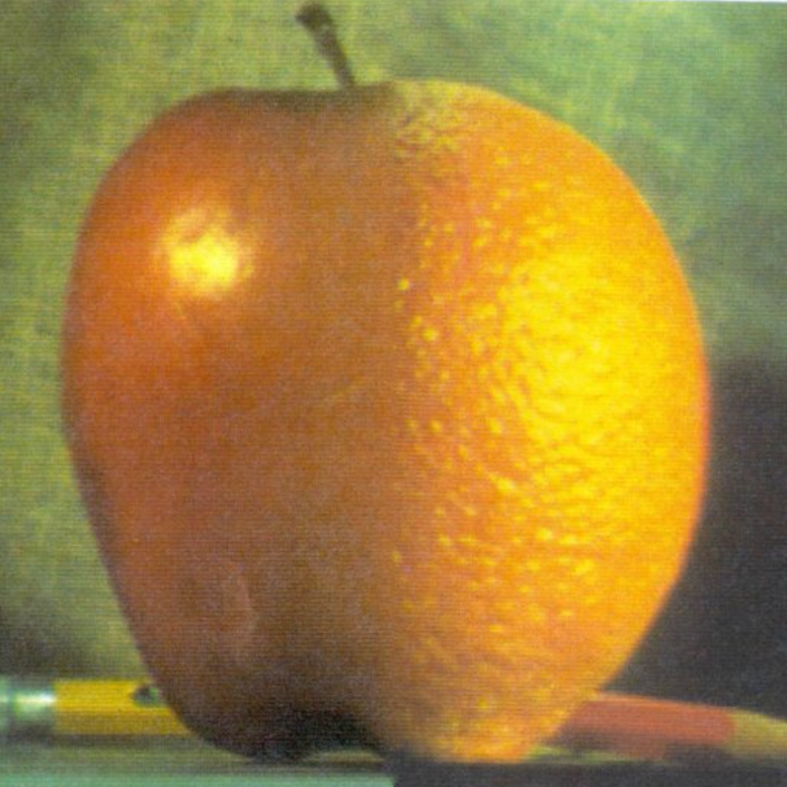结果</center></td>
        </tr>
    </table>

5. (2004 IJCV)**Distinctive Image Featuresfrom Scale-Invariant Keypoints**  [code]() [知乎]()

    sift 尺度不变特征变换匹配算法！

    在 CNN 火以前，计算机视觉中 SOTA 的图像特征提取器，分为两个阶段——特征检测 + 特征描述，提取的特征具有尺度不变性、旋转不变性、亮度不变性等。

    这里只实现了第一阶段，利用 LOG 金字塔检测特征点，正确性尚未验证。后续有空会更新后续的特征点描述，并封装成一个接口（CPU/CUDA）。

    <table>
    	<tr>
            <td align='center' valian='middle'><center>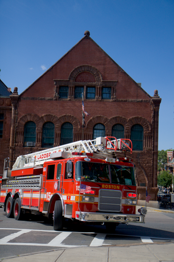输入</center></td>
            <td align='center' valian='middle'><center>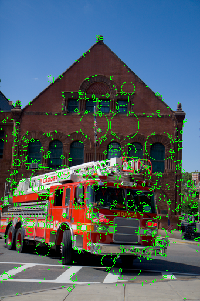结果</center></td>
        </tr>
    </table>

6. (1997 IJCV)SUSAN: A New Approach to Low Level Image Processing [code]() [知乎]()

    SUSAN，比较有意思的一个图像处理算子，可以处理包括角点检测、边缘检测、去噪等。

    角点检测

    <table>
    	<tr>
            <td align='center' valian='middle'><center>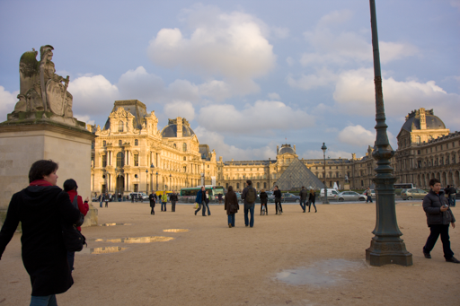输入</center></td>
            <td align='center' valian='middle'><center>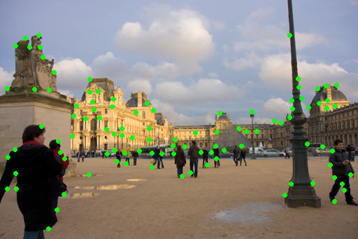输出</center></td>
        </tr>
    </table>

    边缘检测

    <table>
    	<tr>
            <td align='center' valian='middle'><center>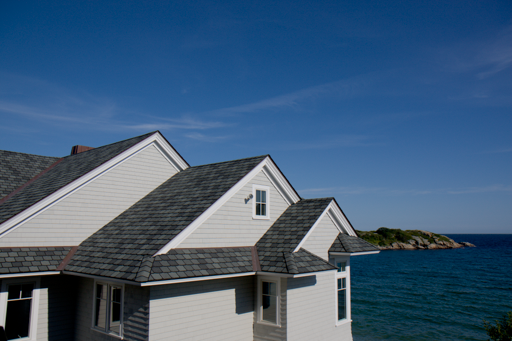输入</center></td>
            <td align='center' valian='middle'><center>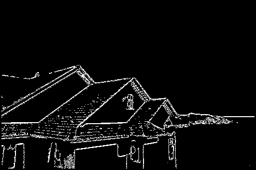输出</center></td>
        </tr>
    </table>

    去噪

    <table>
    	<tr>
            <td align='center' valian='middle'><center>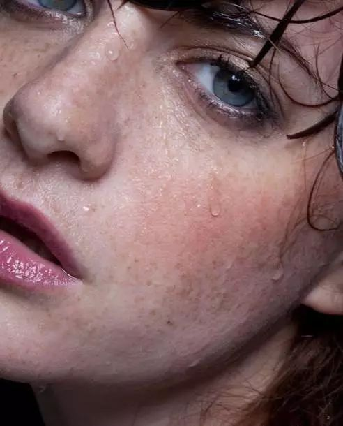输入</center></td>
            <td align='center' valian='middle'><center>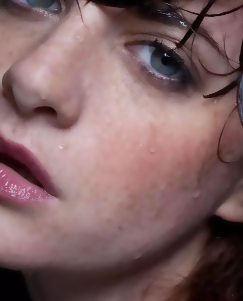输出</center></td>
        </tr>
    </table>


## editing

1. (2003 SIGGRAPH)**Poisson Image Editing**  [code]()   [知乎]()

    泊松编辑（泊松融合），非常经典的文章，基于梯度域做图像编辑、图像融合！

    <table>
    	<tr>
            <td align='center' valian='middle'><center>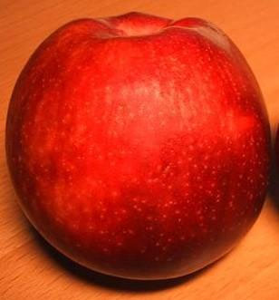背景</center></td>
            <td align='center' valian='middle'><center>前景</center></td>
            <td align='center' valian='middle'><center>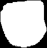掩码</center></td>
        </tr>
        <tr>
            <td align='center' valian='middle'><center>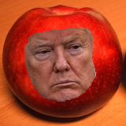直接粘贴</center></td>
            <td align='center' valian='middle'><center>初步结果</center></td>
            <td align='center' valian='middle'><center>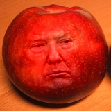梯度混合</center></td>
        </tr>
    </table>

    更多的应用包括纹理交换、局部纹理消除、局部纹理抹平、局部色彩变幻、局部动态范围压缩等。

    

## filter


## fusion

1. (2007)**Exposure Fusion**  [code]()   [知乎]()

    经典的多曝光图像融合算法，但要求强对齐，使用了 Laplace Pyramid 融合消除 halo。

    <table>
    	<tr>
            <td align='center' valian='middle'><center>曝光 1</center></td>
            <td align='center' valian='middle'><center>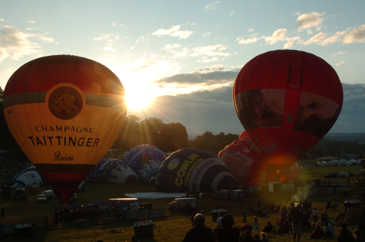曝光 2</center></td>
            <td align='center' valian='middle'><center>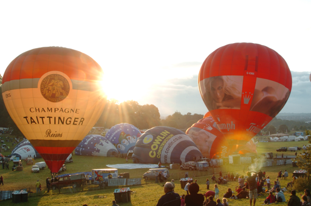曝光 3</center></td>
        </tr>
        <tr>
            <td align='center' valian='middle'><center>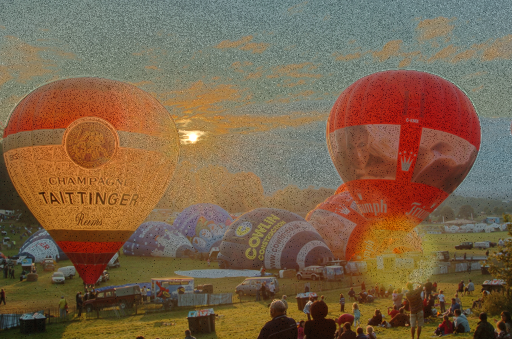直接融合 </center></td>
            <td align='center' valian='middle'><center>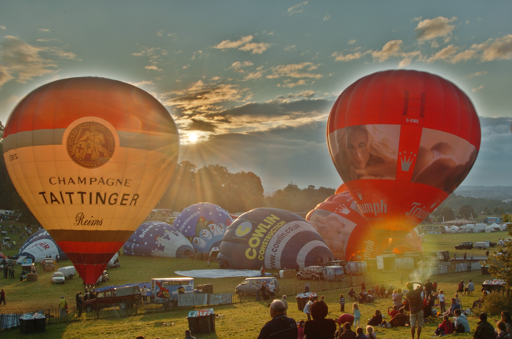高斯平滑 </center></td>
            <td align='center' valian='middle'><center>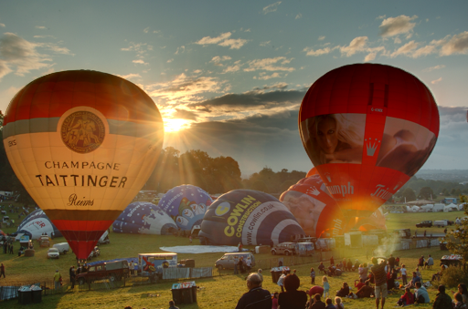金字塔融合</center></td>
        </tr>
    </table>


## geometry

几何。这部分比较难，是计算机视觉三大问题之一。个人准备在这模块学习一些多视角变换、相机标定等知识，应用的话如一些 RACSAC、stitching 算法等等。

waiting

1. 二维旋转 [code](https://github.com/hermosayhl/image_processing/tree/main/geometry/affine_transformation/rotation)

    


## HDR

这部分东西也比较多，资料不好找。目前先实现一些简单的 HDR，动态范围压缩。

1. (2002)**Fast Bilateral Filtering for the Display of High-Dynamic-Range Images** [code]()   [知乎]()

    <table>
    	<tr>
            <td align='center' valian='middle'><center>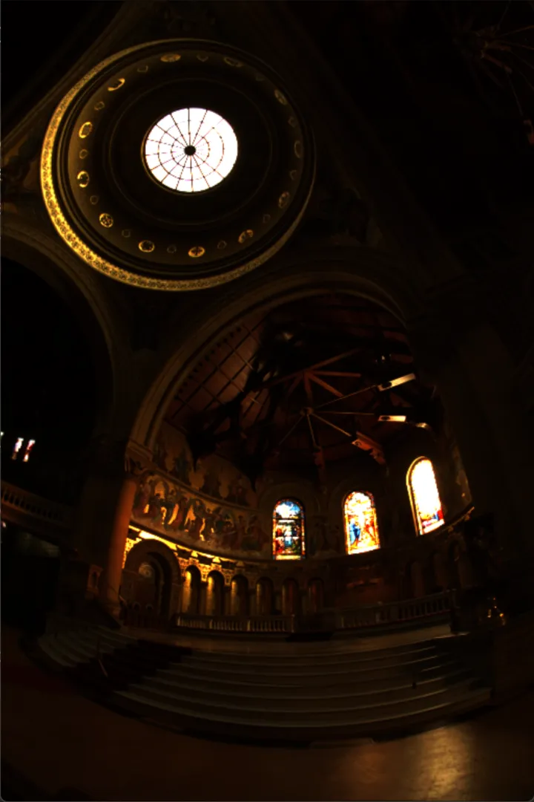输入</center></td>
            <td align='center' valian='middle'><center>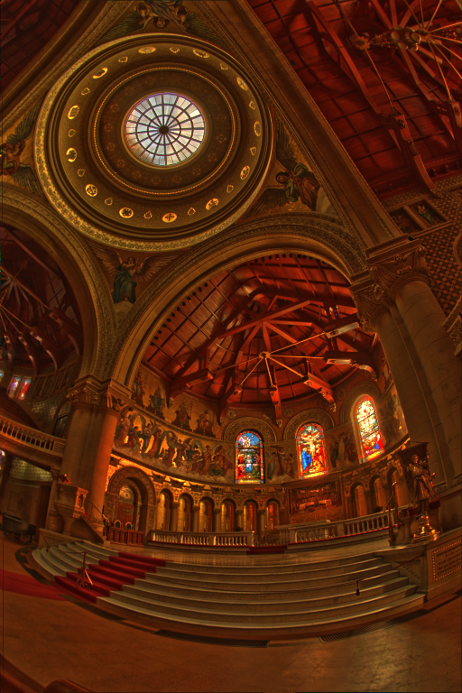输出</center></td>
            </tr>
    </table>

    


## inpainting

waiting


## interpolation

1. 最近邻 && bilinear && bicubic

    目前只实现了 bilinear 和 bicubic 的 CPU 版本实现（为加速），后续会推出加速篇（CPU 优化和 CUDA 优化版本）

    bilinear

    bicubic

    

2. (2007 TOG)**Joint Bilateral Upsampling**    [code]()  [知乎]()

    联合双边上采样算法。

    这部分写了一版光流上采样的代码，但是效果不太好，后续有空再 debug

 

## low-light

1. (2011 SIGGRAPH)**Fast efficient algorithm for enhancement of low lighting video**   [code]()  [知乎]()

    比较有创新的算法，对低光照图像的反转图像做去雾，再取反即可。

    <table>
    	<tr>
            <td align='center' valian='middle'><center>输入</center></td>
            <td align='center' valian='middle'><center>输出</center></td>
        </tr>
        <tr>
            <td align='center' valian='middle'><center>反转图像</center></td>
            <td align='center' valian='middle'><center>去雾图像</center></td>
        </tr>
    </table>


## matting


## optical flow


## super resolution


## 参考

测试图像来源

```latex
@inproceedings{bychkovsky2011learning,
  title={Learning photographic global tonal adjustment with a database of input/output image pairs},
  author={Bychkovsky, Vladimir and Paris, Sylvain and Chan, Eric and Durand, Fr{\'e}do},
  booktitle={CVPR 2011},
  pages={97--104},
  year={2011},
  organization={IEEE}
}
```

