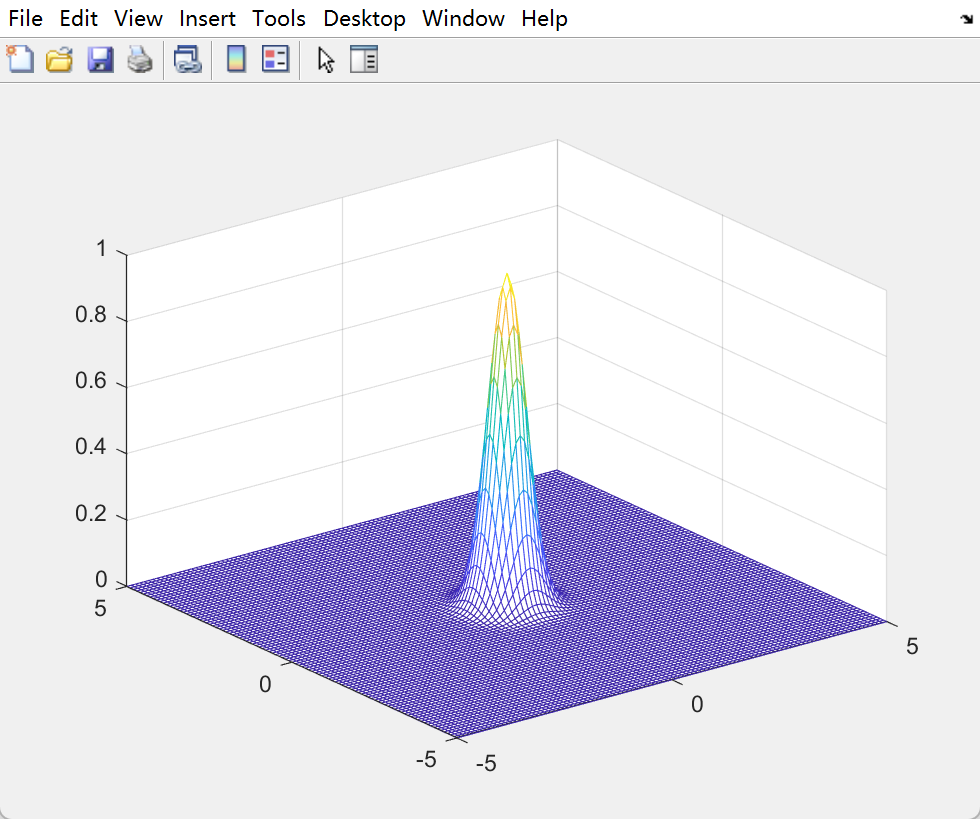
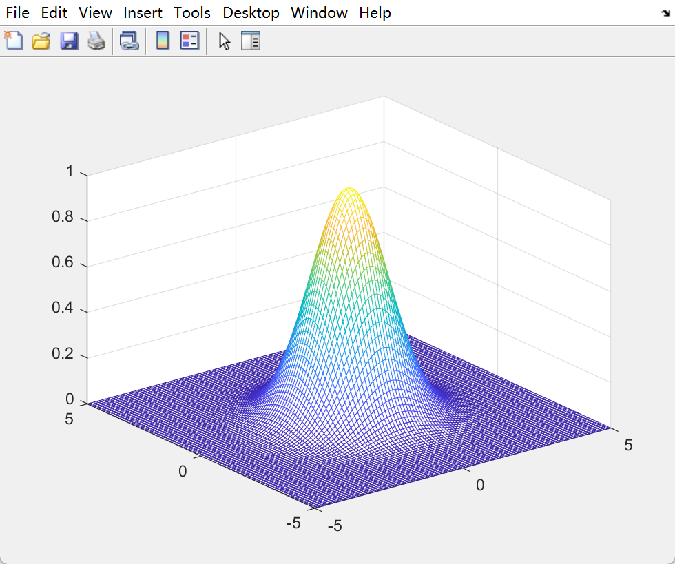
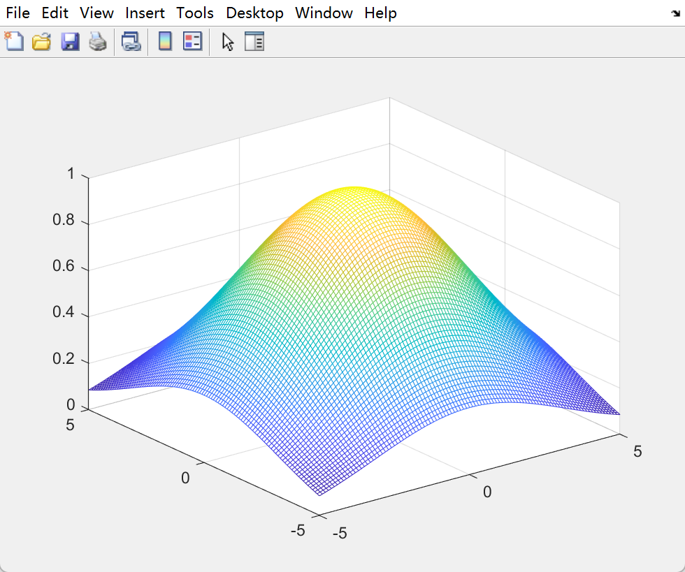

# 高斯滤波

又名高斯模糊，最基础也是最简单的滤波算法之一。

高斯滤波核是空域上的低通滤波器，从中心到四周是对称的，距离越远，影响力越小。以下是二维高斯核的空间分布，方差分别是 0.5, 1.5 和 4.5 。

     

在 sift 中还特别说明，高斯卷积核是实现尺度变换的唯一变换核，并且是唯一的线性核。

## 原理

二维高斯函数在高斯滤波中的形式
$$
G(x, y, x_0, y_0) = \frac{1}{2\pi {\sigma}^2} {e^{-\frac{{(x - x_0)}^2 + {(y - y_0)}^2}{2{\sigma}^2}}}
$$
其中，$(x_0, y_0)$ 是中心的坐标，$(x, y)$ 和滤波核窗口内任意一点的坐标。

以上求的只是 $(x, y)$ 对 $(x_0, y_0)$  的权重，也就是影响力，还要乘以  $(x, y)$  的像素值，最后加权得到中心的滤波结果。

但实际图像中，滤波器内部的点是离散的，而且是只有离散的一部分（滤波器窗口限制了），因此，需要对权重做归一化
$$
\begin{aligned}
\hat{G}(x, y, x_0, y_0) &= \frac{1}{Z} \times \frac{1}{2\pi {\sigma}^2} {e^{-\frac{{(x - x_0)}^2 + {(y - y_0)}^2}{2{\sigma}^2}}} \\
Z &= \sum_{(x,y) \in \Omega}{\frac{1}{2\pi {\sigma}^2} {e^{-\frac{{(x - x_0)}^2 + {(y - y_0)}^2}{2{\sigma}^2}}}}
\end{aligned}
$$
$\Omega$ 是卷积核窗口的所有点集合。

因此，高斯滤波的操作就是，原图中任意一点 $(u, v)$，其值 $V(u, v)$
$$
Gaussi(u, v) = \sum_{(x, y) \in \Omega}{\hat{G}(x, y, u, v) \times V(x, y)}
$$

## 改进

给定图像宽高 $W \times H$，滤波器大小为 $X \times Y$，每个点都要对周围窗口 $X \times Y$ 的点进行距离加权计算，则高斯滤波的时间复杂度是 $O(W \times H \times X \times Y)$ ，复杂度相对较高。

但其实，两个一维高斯滤波可以替代二维的高斯滤波，从公式出发
$$
\begin{aligned}
G(x, y, x_0, y_0) &= \frac{1}{2\pi {\sigma}^2} {e^{-\frac{{(x - x_0)}^2 + {(y - y_0)}^2}{2{\sigma}^2}}} \\
&= \frac{1}{2\pi {\sigma}^2}{e^{-\frac{{(x - x_0)}^2}{2{\sigma}^2}} \times e^{-\frac{{(y - y_0)}^2}{2{\sigma}^2}} } \\
&= \frac{1}{\sqrt{2\pi {\sigma}^2}}{e^{-\frac{{(x - x_0)}^2}{2{\sigma}^2}}} \times \frac{1}{\sqrt{2\pi {\sigma}^2}}{e^{-\frac{{(y - y_0)}^2}{2{\sigma}^2}}}
\end{aligned}
$$
等效于两个一维的高斯卷积核 **相继** 滤波。

为什么说相继呢？
$$
\begin{aligned}
\hat{G}(x, y, x_0, y_0) &= \frac{1}{Z} \times \frac{1}{2\pi {\sigma}^2} {e^{-\frac{{(x - x_0)}^2 + {(y - y_0)}^2}{2{\sigma}^2}}} \\
 &= \frac{1}{Z_x} \times \frac{1}{\sqrt{2\pi {\sigma}^2}}{e^{-\frac{{(x - x_0)}^2}{2{\sigma}^2}}} \times \frac{1}{Z_y} \times \frac{1}{\sqrt{2\pi {\sigma}^2}}{e^{-\frac{{(y - y_0)}^2}{2{\sigma}^2}}}\\ \\
 &= \hat{G}(x, x_0) \times \hat{G}(y, y_0) \\ \\
Z_x &= \sum_{(x,y) \in \Omega}{\frac{1}{2\pi {\sigma}^2} {e^{-\frac{{(x - x_0)}^2}{2{\sigma}^2}}}} \\
Z_y &= \sum_{(x,y) \in \Omega}{\frac{1}{2\pi {\sigma}^2} {e^{-\frac{{(y - y_0)}^2}{2{\sigma}^2}}}}
\end{aligned}
$$
分别对 x, y 计算，到底节省计算在哪里？哪里有重复计算 ? 搞清楚

## 实现细节

